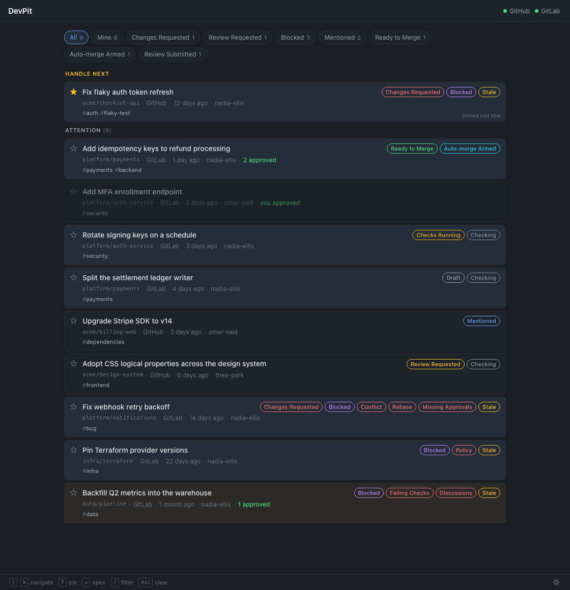

# DevPit

**What requires my attention right now?**



DevPit is a self-hosted, read-only **attention center**: one ranked list of the
MRs/PRs that need *you*, across GitHub and GitLab, with optional Jira status.
Repositories become context — you are the center of the workflow. It runs on
your machine, with your tokens, talks only to your forges, and never acts on
your behalf (every action is a deep link out). Why it exists and how it decides
what matters: [`docs/Why.md`](docs/Why.md).

## Install

A single binary that embeds the web UI and one SQLite file; no runtime, no
services to stand up. Artifacts for macOS, Linux, and Windows (best-effort), plus
a Docker image, are published on each release. The full matrix and its rationale:
[`ADR-0023`](ADR/ADR-0023_Packaging_Distribution_and_Release_Pipeline.md).

### Homebrew (macOS)

```sh
brew install vilaca/devpit/devpit
brew services start devpit    # launch at login and keep running
# …or just run it in the foreground:
devpit
```

Then open <http://localhost:7474>. Configure it first — see [Setup](#setup) below.

### Docker

The image is `ghcr.io/vilaca/devpit`. A container binds all interfaces
(`listen: :7474` in its config) but the host publishes **loopback only**, so the
no-auth posture ([`ADR-0001`](ADR/ADR-0001_Local_First_Web_Application.md)) is
preserved:

```sh
docker run --rm \
  -v ~/.config/devpit/config.yaml:/etc/devpit/config.yaml:ro \
  -p 127.0.0.1:7474:7474 \
  ghcr.io/vilaca/devpit --config /etc/devpit/config.yaml
```

That config must set `listen: :7474`. Or with Compose — the DB volume is
**optional** (the event store is a rebuildable cache; dropping it re-syncs within
one cycle and costs only your "Handle next" pins and hover history), the config
mount is always required:

```yaml
# compose.yaml
services:
  devpit:
    image: ghcr.io/vilaca/devpit:latest
    command: ["--config", "/etc/devpit/config.yaml"]
    ports:
      - "127.0.0.1:7474:7474"     # host loopback only
    volumes:
      - ./config.yaml:/etc/devpit/config.yaml:ro   # required
      - devpit-db:/var/lib/devpit                  # optional (rebuildable cache)
    healthcheck:
      test: ["CMD-SHELL", "wget -qO- http://localhost:7474/up || exit 1"]
      interval: 30s
      timeout: 3s
      retries: 3
    restart: unless-stopped
volumes:
  devpit-db:
```

The `config.yaml` for Compose sets `listen: :7474` and
`db_path: /var/lib/devpit/devpit.db`.

### Linux (systemd)

Download the `linux` binary from
[Releases](https://github.com/vilaca/devpit/releases), then use the committed
user unit — [`packaging/devpit.service`](packaging/devpit.service):

```sh
mkdir -p ~/.local/bin ~/.config/systemd/user
cp devpit ~/.local/bin/
cp packaging/devpit.service ~/.config/systemd/user/
systemctl --user enable --now devpit
```

### Windows (best-effort)

Untested; Docker is recommended. Download `devpit.exe` from
[Releases](https://github.com/vilaca/devpit/releases) and run it with an explicit
config path:

```powershell
devpit.exe --config C:\path\to\config.yaml
```

## Setup

One YAML file (default `~/.config/devpit/config.yaml`; `chmod 600` it — it holds
plaintext tokens):

```yaml
db_path: ~/.local/share/devpit/devpit.db
connections:
  - id: github-personal
    type: github
    token: ghp_…                    # classic or fine-grained
  - id: work-gitlab
    type: gitlab
    base_url: https://gitlab.example.com
    token: glpat-…                  # read_api scope
jira:                               # optional — Jira status enrichment
  base_url: https://example.atlassian.net
  email: you@example.com
  api_token: …
```

Per connection only `id`, `type`, and `token` are required; the full schema and
validation live in [`internal/config/config.go`](internal/config/config.go).
Creating each token with the exact minimal scopes, and the GitHub
classic-vs-fine-grained trade-off, are in
[`docs/Token_Setup.md`](docs/Token_Setup.md).

## Understanding the list

Every chip, badge, tint, and the ranking rules are catalogued in
[`docs/UI_Vocabulary.md`](docs/UI_Vocabulary.md) — start with
["Why is this item here, in this order?"](docs/UI_Vocabulary.md#why-is-this-item-here-in-this-order)
and ["Why is something missing?"](docs/UI_Vocabulary.md#why-is-something-missing).

## Updating

DevPit checks GitHub for a newer release at startup and daily, and shows a quiet
"update available" chip in the top bar (it never self-updates — the chip links
out; [`ADR-0023`](ADR/ADR-0023_Packaging_Distribution_and_Release_Pipeline.md)).
Upgrade with your install channel:

```sh
brew upgrade vilaca/devpit/devpit      # Homebrew
docker pull ghcr.io/vilaca/devpit      # Docker
```

## Design docs

`docs/` holds the specs; `ADR/` holds every decision with its rationale
([`ADR-0014`](ADR/ADR-0014_Documentation_As_Design_Record.md)). Start with
[`docs/Why.md`](docs/Why.md) and
[`docs/High_Level_Architecture.md`](docs/High_Level_Architecture.md).

## Contributing

See [`docs/Contributing.md`](docs/Contributing.md). The demo world behind the
screenshot above lives in [`scripts/demo/`](scripts/demo/README.md).

## License

[MIT](LICENSE)
